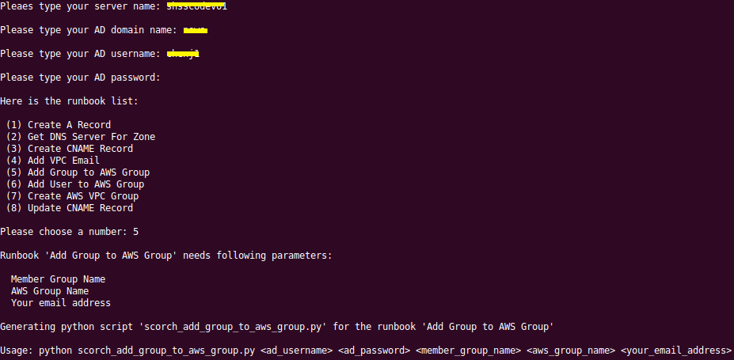

# pyMSScorch

## Description
pyMSScorch is a tool that can generate python clients for your Microsoft System Center Orchestrator runbooks.   

## Install
pyMSScorh requires [pyHyperV](https://github.com/oznu/pyHyperV) module.

```bash
pip install pyHyperV
```
## Usage
```bash
./pyMSScorch.py
```



